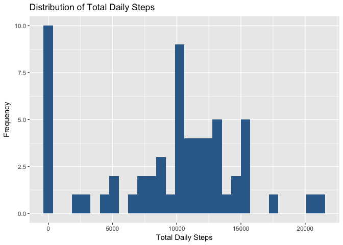
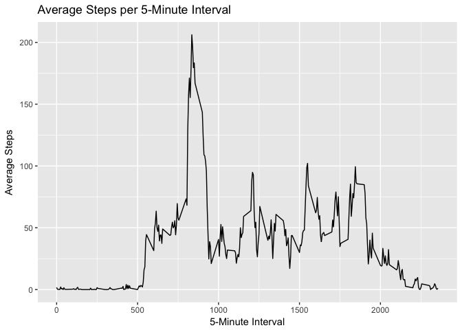
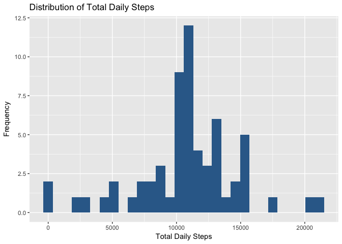
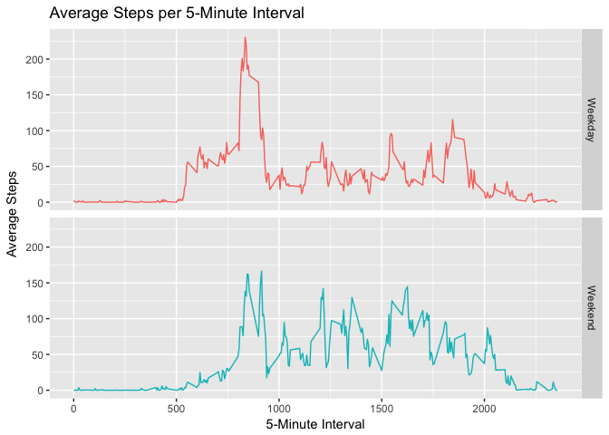

# Reproducible Research: Peer Assessment 1
  
To run this code locally, open the R Project in RStudio or use `sedwd()` to change the R session's working directory to where the `activity.csv` file is located.
  
## Loading and preprocessing the data
  
Let's bring in some data!


```r
library(dplyr)
```

```
## 
## Attaching package: 'dplyr'
```

```
## The following objects are masked from 'package:stats':
## 
##     filter, lag
```

```
## The following objects are masked from 'package:base':
## 
##     intersect, setdiff, setequal, union
```

```r
library(ggplot2)

# read in data
activity.df <- read.csv("activity.csv")

# convert date strings to date class
activity.df$date <- as.Date(activity.df$date, format="%Y-%m-%d")
```

## What is mean total number of steps taken per day?

Make a histogram of total steps per day.


```r
activity.df %>% 
  group_by(date) %>% 
  summarise(total_steps = sum(steps, na.rm = TRUE)) %>% 
  ggplot(aes(total_steps, fill = 1)) +
  theme(legend.position="none") +
  geom_histogram(bins = 30) +
  ggtitle("Distribution of Total Daily Steps") +
  xlab("Total Daily Steps") +
  ylab("Frequency")
```

<!-- -->
  
Calculate the __mean__ and __median__ steps per day.


```r
activity.df %>% 
  group_by(date) %>% 
  summarise(total_steps = sum(steps, na.rm = TRUE)) %>% 
  ungroup() %>% 
  summarise(mean = mean(total_steps), median = median(total_steps)) %>% 
  as.data.frame()
```

```
##      mean median
## 1 9354.23  10395
```

## What is the average daily activity pattern?

Plot the average daily pattern.


```r
activity.df %>% 
  group_by(interval) %>% 
  summarise(average_steps = mean(steps, na.rm = TRUE)) %>% 
  ggplot(aes(interval, average_steps)) +
  geom_line() +
  ggtitle("Average Steps per 5-Minute Interval") +
  xlab("5-Minute Interval") +
  ylab("Average Steps")
```

<!-- -->
  
Find the 5-minute interaval that has the maximum average number of steps


```r
activity.df %>% 
  group_by(interval) %>% 
  summarise(average_steps = mean(steps, na.rm = TRUE)) %>% 
  as.data.frame() -> avg.steps

avg.steps[avg.steps$average_steps == max(avg.steps$average_steps),]
```

```
##     interval average_steps
## 104      835      206.1698
```

## Imputing missing values

Find out how many missing values there are.


```r
nacount <- sum(is.na(activity.df$steps))
totalrecords <- nrow(activity.df)

nacount
```

```
## [1] 2304
```
  
There are 2304 missing values out of 17568 total records, or 0.13% missing.  
  
Let's replace and missing values with the average number of steps for that 5-minute interval.


```r
# write function to replace NAs
replace.nas <- function(df) {
  new.df <- df
  for (i in 1:nrow(new.df)) {
    if (!is.na(new.df$steps[i])) {
      next
    } else {
      new.df$steps[i] <- round(
        avg.steps[avg.steps$interval==new.df$interval[i],]$average_steps
      )
    }
  }
  return(new.df)
}

# create new data set with no NAs
no.nas <- replace.nas(activity.df)
```
  
Make a new histogram of total steps per day with NAs replaced.


```r
no.nas %>% 
  group_by(date) %>% 
  summarise(total_steps = sum(steps, na.rm = TRUE)) %>% 
  ggplot(aes(total_steps, fill = 1)) +
  theme(legend.position="none") +
  geom_histogram(bins = 30) +
  ggtitle("Distribution of Total Daily Steps") +
  xlab("Total Daily Steps") +
  ylab("Frequency")
```

<!-- -->
  
Calculate the *__NEW__* __mean__ and __median__ steps per day.


```r
no.nas %>% 
  group_by(date) %>% 
  summarise(total_steps = sum(steps, na.rm = TRUE)) %>% 
  ungroup() %>% 
  summarise(mean = mean(total_steps), median = median(total_steps)) %>% 
  as.data.frame()
```

```
##       mean median
## 1 10765.64  10762
```
  
Imputing the NA values in the data set increases the mean and the median from the original calculation. With the NAs replaced, much of the skewness of the distribution of total steps per day has also been removed, and the mean and median are now very close in value.
  
## Are there differences in activity patterns between weekdays and weekends?

Create a new column called `daytype` for a factor variable indicating if the observed day is a weekday or weekend day.


```r
no.nas$daytype <- factor(
  ifelse(weekdays(no.nas$date) %in% c("Saturday", "Sunday"),
         "Weekend",
         "Weekday")
  )
```
  
Plot the average steps per 5-minute inverval for Weekends and Weekdays in a panel plot to reveal any differences.


```r
no.nas %>% 
  group_by(interval, daytype) %>% 
  summarise(average_steps = mean(steps, na.rm = TRUE)) %>% 
  ggplot(aes(interval, average_steps, color = daytype)) +
  theme(legend.position="none") +
  geom_line() +
  facet_grid(daytype ~ .) +
  ggtitle("Average Steps per 5-Minute Interval") +
  xlab("5-Minute Interval") +
  ylab("Average Steps")
```

<!-- -->
  
We can now see that on the weekends there is a smaller morning spike in the average number of steps and more average steps through the middle of the day.
  
